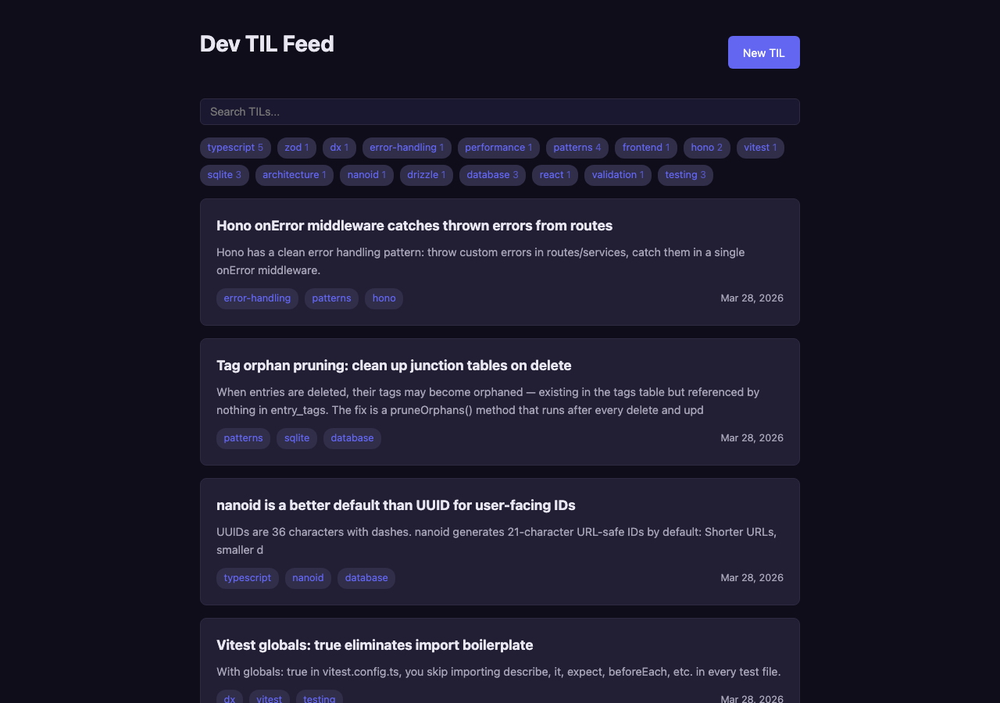
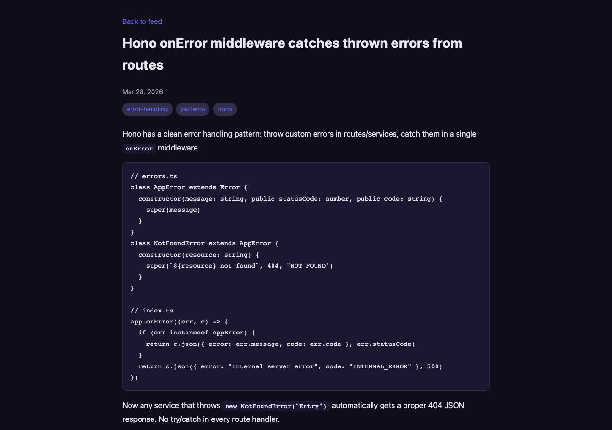
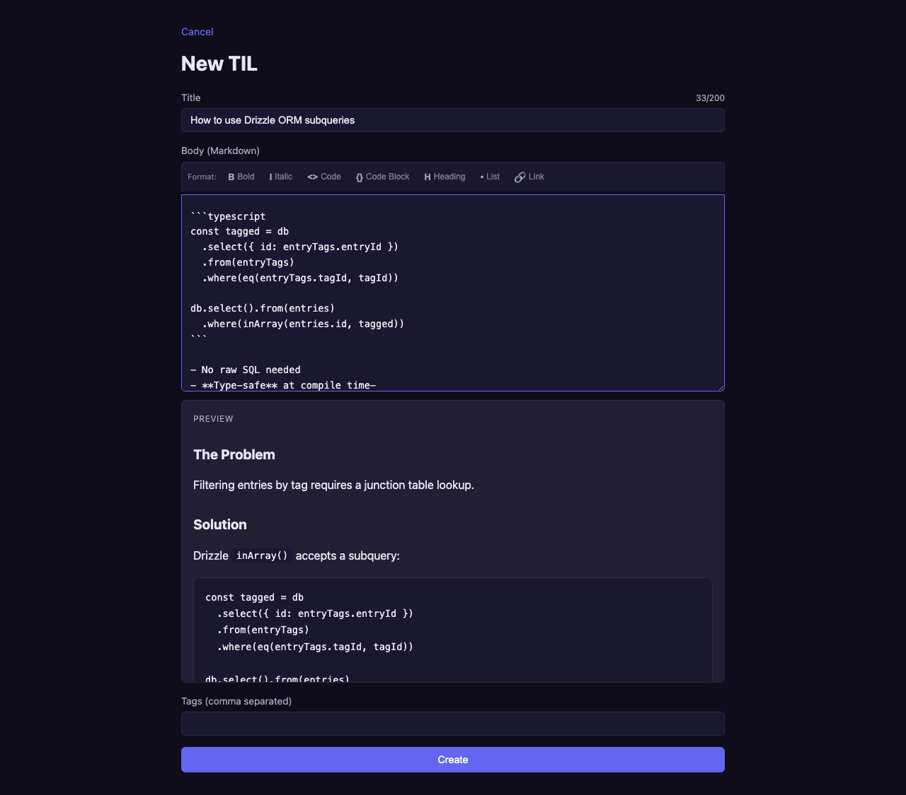

# Dev TIL Feed

A personal "Today I Learned" logger for developers. Write, tag, search, and browse daily learnings with full Markdown support.

### Demo

[demo.webm](https://github.com/HeyItWorked/dev-til-feed/raw/main/docs/demo.webm)

### Feed — search, tag filter, paginated cards


### Entry — full markdown rendering with code blocks


### Editor — toolbar, live preview, character count


## Stack

- **Backend:** Hono + SQLite (better-sqlite3) via Drizzle ORM
- **Frontend:** React 19 + Vite SPA
- **Testing:** Vitest (25 tests — unit + integration)
- **Validation:** Zod
- **IDs:** nanoid

## Features

- Full CRUD for TIL entries with tagging
- Markdown rendering (GFM — code blocks, tables, lists, bold/italic)
- Tag cloud with click-to-filter
- Debounced search across title and body
- Paginated feed with body preview (markdown stripped)
- Editor with markdown toolbar, live preview, auto-capitalize, tab indent, list continuation
- Unsaved changes warning on navigation
- Title character count (200 max)
- Inline delete confirmation (no browser dialogs)
- Dark indigo theme
- Dynamic page titles
- Friendly 404 page

## Architecture

```
Routes → Services → Repositories (interfaces)
                         ↓
                  SQLite via Drizzle ORM
```

- **Repository pattern** with dependency injection — services accept interfaces, tests inject mocks
- **`createApp({ entryRepo, tagRepo })`** factory for DI
- **No business logic in route handlers** — routes validate with Zod, delegate to services
- Tags auto-created on first use, auto-pruned when orphaned

## API

| Method | Endpoint | Description |
|--------|----------|-------------|
| `POST` | `/api/entries` | Create entry (201) |
| `GET` | `/api/entries` | List entries, paginated (200) |
| `GET` | `/api/entries/:id` | Get full entry (200) |
| `PUT` | `/api/entries/:id` | Update entry (200) |
| `DELETE` | `/api/entries/:id` | Delete entry (204) |
| `GET` | `/api/tags` | List tags with counts (200) |

Query params for list: `q` (search), `tag` (filter), `page`, `pageSize`

## Running Locally

```bash
# Backend
npm install
mkdir -p data
npx drizzle-kit push
npm run dev              # http://localhost:3000

# Frontend
cd client
npm install
npm run dev              # http://localhost:5173 (proxies /api → :3000)
```

## Docker

```bash
docker compose up -d     # builds + runs on port 3003
```

Data persists in a Docker volume (`til-data`).

## Testing

```bash
npm test                 # 25 tests (unit + integration)
npm run test:watch       # watch mode
```

## Project Structure

```
src/
├── db/                  # Drizzle schema + SQLite client
├── errors.ts            # AppError, NotFoundError, ValidationError
├── validators/          # Zod schemas
├── repositories/        # Interfaces + SQLite implementations
├── services/            # Business logic (EntryService, TagService)
├── routes/              # Hono route factories
├── index.ts             # createApp factory with DI + error middleware
└── server.ts            # Production entry point

client/
├── src/api/             # Typed fetch wrappers
├── src/components/      # EntryCard, TagCloud, SearchBar, EditorForm, Pagination, Markdown
├── src/pages/           # FeedPage, EntryPage, EditorPage
└── vite.config.ts       # Proxy config

tests/
├── unit/                # Service tests with mock repos
├── integration/         # Route tests via app.request()
└── mocks/               # Mock repo factories
```
